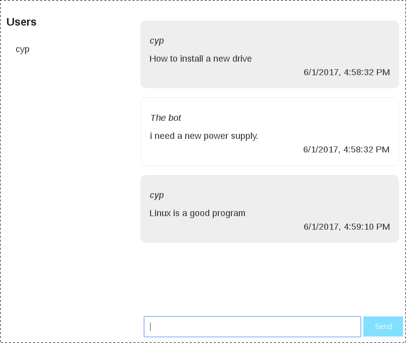

# Chatty-Brain

Simple chat that uses [natural brain](https://github.com/mysamai/natural-brain) to detect words during discussion and provide answers.

## Training 

Edit datalearn.json file for add a phrase and category. The data will be inserted into the nedb database and will be added to natural-brain

Edit datatrainer.json file for training natural-brain.

## Requirements

- vuejs
- nodejs
- socket.io
- natural-brain
- nedb 
